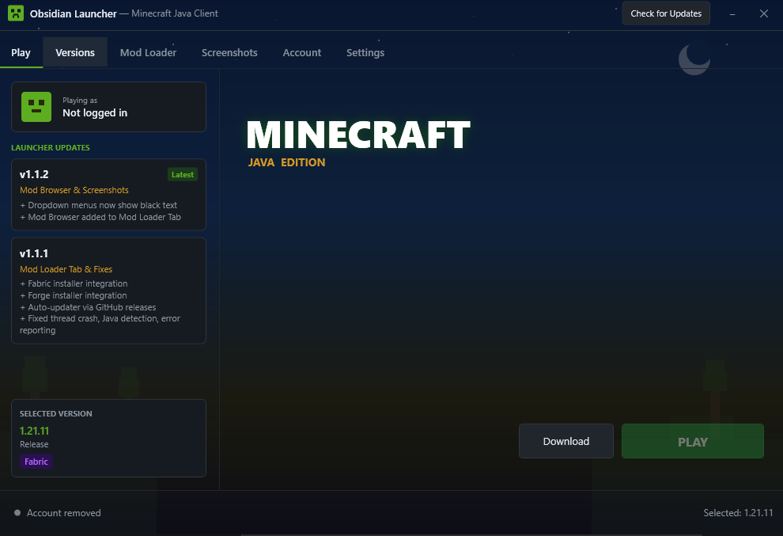

# Obsidian Launcher

**Obsidian Launcher** is a custom, Minecraft: Java Edition launcher built with WPF (Windows Presentation Foundation).  
It downloads official Mojang version metadata and assets directly, supports local (offline) accounts, and lets you install **Fabric** and **Forge** mod loaders with a single click.

## ✨ Features

- 🔹 **Fully Offline** – No Microsoft account required; use local usernames.
- 🔹 **Version Manager** – Browse and download any Minecraft release or snapshot from Mojang’s manifest.
- 🔹 **Mod Loader Integration**
  - Install **Fabric** – lightweight, modern modding.
  - Install **Forge** – the classic, widely‑used mod platform.
- 🔹 **Dark Minecraft‑themed UI** – Inspired by the game’s palette (grass greens, stone grays, obsidian blacks).
- 🔹 **Custom JVM Settings** – Configure memory allocation, additional JVM arguments, and Java executable path.
- 🔹 **Download Progress** – Real‑time library and asset download tracking with progress bars.
- 🔹 **One‑Click Launch** – Select a version, add an account, and hit **PLAY**.
- 🔹 **Built‑in Updater** – Check for launcher updates (placeholder ready for your own update server).

## 🖥️ Requirements

- Windows 10 / 11 (64‑bit)
- Java Runtime 17+ (or JDK)
- .NET Framework 4.7.2 **or** .NET 6/8 Desktop Runtime (see build instructions)

## 🚀 Getting Started

### Pre‑built Release (recommended)
1. Go to the [Releases](https://github.com/CyberLifeYT/ObsidianLauncher/releases) page.
2. Download the latest `ObsidianLauncher.zip`.
3. Extract and run `ObsidianLauncher.exe`.

### First Launch
- The launcher will auto‑detect installed Java; if not found, configure the path in **Settings → Java**.
- Click the **Versions** tab, select a Minecraft version, and download it.
- Add a local account in the **Account** tab (any username ≥3 characters).
- (Optional) Install Fabric or Forge in the **Mod Loader** tab.
- Go to the **Play** tab and press **PLAY**.
